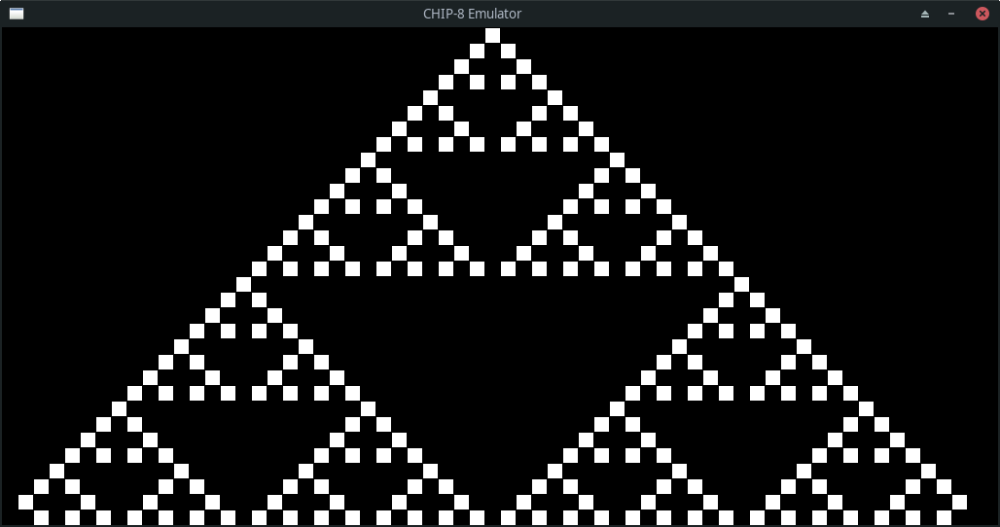
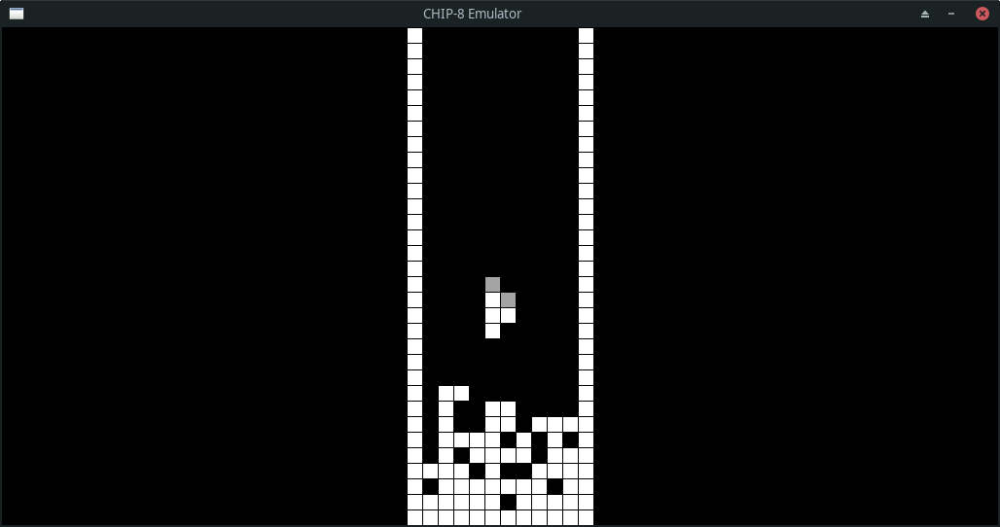
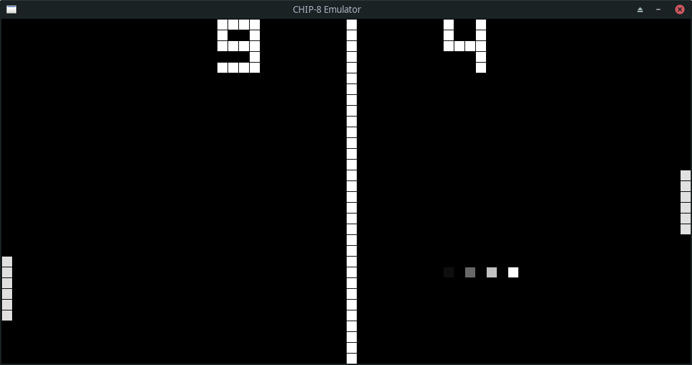
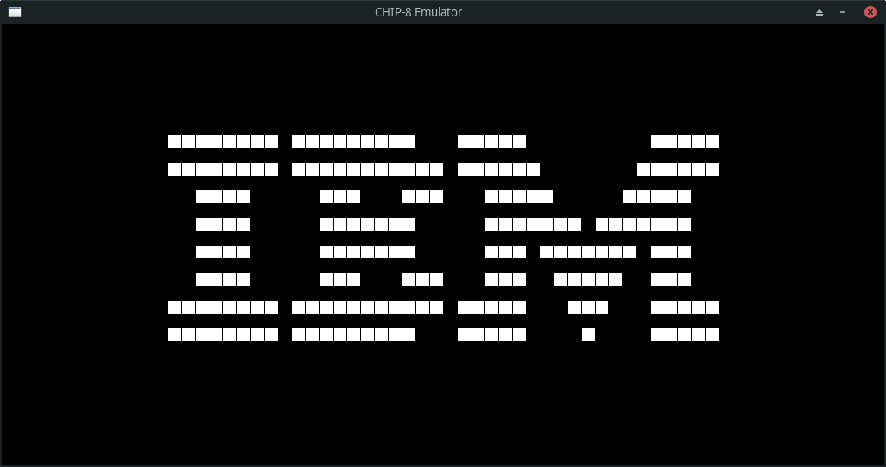

# chip-8 emulator

### The "Hello, emulation world!" project

## Features
- [x] Chip-8 Instruction Set Support
- [x] Graphics via macroquad
- [x] Input support
- [x] Pixels fade-off effect to avoid flicker 
- [ ] Beeping sound
- [ ] Super Chip Support

## How to use
```
cargo run --release -- /path/to/rom_file.ch8
```
Default keypad is defined for qwerty keyboard:
```
1234       123C
qwer  ==>  456D
asdf  ==>  789E
zxcv       A0BF
```

## Screenshots

<p align="center">
  
  
</p>

<p align="center">
  
  
</p>